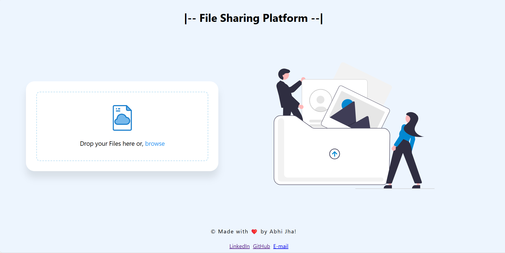

#File Sharing Platform
Welcome to the File Sharing Platform repository! This project is designed to provide a simple, secure, and efficient way to upload and share files.

#Features
Drag & Drop Uploads: Easily upload files by dragging and dropping them into the upload area.
Progress Tracking: Visual progress indicators to show the status of your uploads.
Secure Links: Share files with links that automatically expire after 24 hours for added security.
Email Sending: Conveniently send files via email directly from the platform.

#Screenshots

#Installation
To run this project locally, follow these steps:

#Clone the repository:
sh
Copy code
git clone https://github.com/abhisekumarjha/file-sharing-platform.git
Navigate to the project directory:
sh
Copy code
cd file-sharing-platform
Open index.html in your web browser to use the platform.
Usage
Upload Files: Drag and drop files into the upload area or click to browse and select files.
Share Link: Once uploaded, copy the generated link to share with others. The link will expire in 24 hours.
Send via Email: Use the email form to send the uploaded file directly to an email address.

#Contributing
Contributions are welcome! Please fork this repository and submit a pull request for any improvements or new features.

#License
This project is licensed under the MIT License.

#Contact
Feel free to reach out for any questions or feedback:

LinkedIn: [ Abhisekumar Jha](https://www.linkedin.com/in/abhisekumarjha/)
GitHub: [abhisekumarjha](https://github.com/abhisekumarjha)
Email: abhijha2k20@gmail.com
